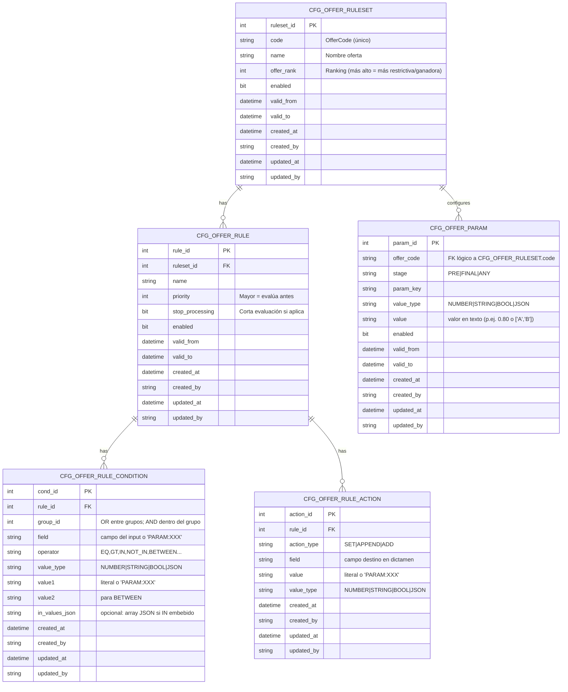

# Ofertas hipotecarias

## Objetivo
Una entidad bancaria desea establecer precios especiales a clientes que cumplan determinados requisitos. Será necesario calcular estos requisitos para determinar qué precio se puede ofrecer.

Además, cada perfil se tendrá que identificar de cara al motor de scoring para que el riesgo se evalue con reglas diferenciadas.

Estas condiciones se establecen en la simulación ya que el precio ha de determinarse antes de facilitar la pre-aprobación. Por tanto, es necesario modificar el simulador para recoger las nuevas variables que permitan calcular la oferta.

La gestión se hará desde la web y desde la aplicación de workflow por lo que serán necesario servicios adicionales o modificar los actuales.

## Diferenciación de precios

Se establecerá una estructura de precios basado en distintas ofertas cubiertas por condiciones en base a plazos, ltv, edad, etc.

## Criterios de Elegibilidad

Para obtener el precio que corresponde a un expediente se realizará una evaluación en tres pasos. 
Se creará un motor de reglas capaz que, dada una configuración de conjuntos de reglas (cada uno aplicado a una oferta) y de parámetros, permitirá obtener las ofertas elegibles y los límites a aplicar.

### Proceso de elegibilidad

Se establecen los primeros campos:

Variable|Cálculo
-|-
Finalidad|Finalidad de la vivienda|
numTitulares|Número de titulares
ingresosT1|T1.Ingresos * T1.NumPagas / 14
ingresosT2|T2.Ingresos * T2.NumPagas / 14
ingresosTotales|(ingresosT1 + ingresosT2)
edadT1|CalculaEdad(T1.NACIMIENTO_DT)
edadT2|CalculaEdad(T2.NACIMIENTO_DT)
antiguedadT1|Meses(T1.ANTIGUEDAD_CLIENTE_DT)
domiciliaNominaT1|T1.DOMICILIA_NOMINA
importeVentaCA|lookup(importeVenta(COMUNIDAD_AUTONOMA_CD))
importeVivienda|IMPORTE_VIVIENDA
tipoAlta|TIPO_ALTA_CD

#### Fase 1 - datos inciales

* Solo tipo alta|PARAM.TPO_ALTA
* Solo primera vivienda|Finalidad = PARAM.FINALIDAD
* Edad| ((EdadT1 < PARAM.EDAD_MAXIMA_T1) Y ((numTitulares=1) O (EdadT2 < PARAM.EDAD_MAXIMA_T2))) OR domiciliaNominaT1 OR domiciliaNominaT2

#### Fase 2 - datos previos

Se aplicarán estas reglas.

Regla|Condición
-|-
ingresosMinimos1T|(numTitulares=1) AND (ingresosT1>PARAM_INGRESOS_MINIMOS_1T)
ingresosMinimos2T|(numTitulares=2) AND (ingresosTotales>PARAM_INGRESOS_MINIMOS_2T)

Los valores indicados en los campos *PARAM* serán configurables.

### Histórico de reglas y  parámetros

Las reglas y los parámetros serán editables y el período de vigencia de cada valor estará historificado. Así se podrá  mantener un histórico y aplicar los que correspondan según la fecha de aplicación del precio. Para facilitar la administración, se separan parámetros (son más fáciles de cambiar para el usuario) y las reglas (más para un perfil técnico). Los cambios aplicados no impactarán en los expedientes en gestión.

Para saber qué reglas y parámetros consultar según la fecha, cuando se asigne una oferta se asignará la FECHA_APLICACION_OFERTA. Se habilitará un parámetro "Meses validez parámetros" para que, al resimular, se usen los parámetros/reglas de la FECHA_APLICACION_OFERTA si esta es posterior a HOY()-Meses validez parámetros. Si ha caducado la fecha se utilizarán los parámetros vigentes y además se asignará el campo FECHA_APLICACIÓN_OFERTA

La evaluación nos ofrecerá las ofertas elegibles que, a su vez, limitarán los valores de entrada en el resto de campos del simulador.

- Mínimo importe de compra
- Mínimo LTV
- Máximo LTV
- Mínimo Plazo
- Máximo Plazo
- Mínimo importe solicitado
- Máximo importe solicitado

#### Fase 3 - datos finales

- Importe Vivienda
- Importe Hipoteca
- Plazo
- Años a fijo. Se ofrecerán los años a fijo definidos para ltv/plazo definido en las reglas, el campo estará oculto o bloqueado (y vacío) mientras no haya información que permita obtener el dato. Si cambian valores y el plazo fijo deja de ser válido se anulará para seleccionarlo de nuevo.

Estos campos estarán restringidos según los límites devueltos en el cálculo de elegibilidad.

Si se produce algún cambio en las variables de la fase 1, deberá volverse a calcular los límites. El *importe de la hipoteca*, el *plazo* se ajustarán automáticamente para no superar los rangos de *plazo* y *LTV* permitidos ni quedar fuera de los *importes mínimo/máximos de la hipoteca*. ⚠️❓Los *años a fijo* no se pueden inferir, se cargará el selector con las posibles opciones que tenga configurada la oferta en el catálogo de precios

# Anexo I - Motor de reglas

## Modelo de datos

Tabla|Finalidad
-|-
CFG_OFFER_RULESET|define cada “oferta” o conjunto de reglas (código, nombre, rank).
CFG_OFFER_RULE|reglas dentro de una oferta, con priority y stop_processing.
CFG_OFFER_RULE_CONDITION|condiciones de disparo de cada regla. group_id: modela lógica OR entre grupos y AND dentro del grupo. field puede ser un campo del input (ltv, edadMax, tipoAlta) o un parámetro (PARAM:REQUIERE_PRIMERA_VIVIENDA). value1/value2 aceptan literales o referencias PARAM:.... Para IN/NOT_IN, o bien usas in_values_json (embebido) o value1=PARAM:LISTA.
CFG_OFFER_RULE_ACTION|acciones al aplicar la regla (SET/APPEND/ADD) sobre el “dictamen”.
CFG_OFFER_PARAM|parámetros por oferta y stage (PRE/FINAL/ANY) y con vigencia.

